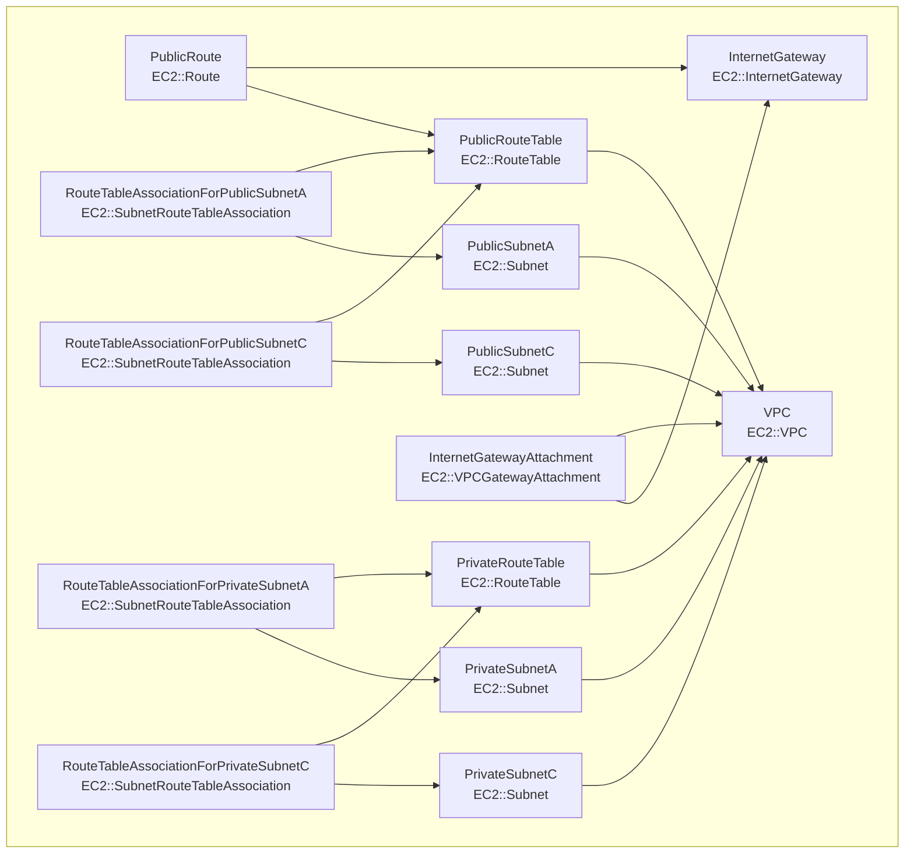

# sam-vpc

```mermaid
        flowchart TB;
                subgraph &nbsp;
                rootPublicSubnetA[PublicSubnetA<br/>EC2::Subnet]-->rootVPC[VPC<br/>EC2::VPC]
                rootPublicSubnetC[PublicSubnetC<br/>EC2::Subnet]-->rootVPC[VPC<br/>EC2::VPC]
                rootPrivateSubnetA[PrivateSubnetA<br/>EC2::Subnet]-->rootVPC[VPC<br/>EC2::VPC]
                rootPrivateSubnetC[PrivateSubnetC<br/>EC2::Subnet]-->rootVPC[VPC<br/>EC2::VPC]
                rootInternetGatewayAttachment[InternetGatewayAttachment<br/>EC2::VPCGatewayAttachment]-->rootInternetGateway[InternetGateway<br/>EC2::InternetGateway]
                rootInternetGatewayAttachment[InternetGatewayAttachment<br/>EC2::VPCGatewayAttachment]-->rootVPC[VPC<br/>EC2::VPC]
                rootPublicRouteTable[PublicRouteTable<br/>EC2::RouteTable]-->rootVPC[VPC<br/>EC2::VPC]
                rootPrivateRouteTable[PrivateRouteTable<br/>EC2::RouteTable]-->rootVPC[VPC<br/>EC2::VPC]
                rootPublicRoute[PublicRoute<br/>EC2::Route]-->rootPublicRouteTable[PublicRouteTable<br/>EC2::RouteTable]
                rootPublicRoute[PublicRoute<br/>EC2::Route]-->rootInternetGateway[InternetGateway<br/>EC2::InternetGateway]
                rootRouteTableAssociationForPublicSubnetA[RouteTableAssociationForPublicSubnetA<br/>EC2::SubnetRouteTableAssociation]-->rootPublicSubnetA[PublicSubnetA<br/>EC2::Subnet]
                rootRouteTableAssociationForPublicSubnetA[RouteTableAssociationForPublicSubnetA<br/>EC2::SubnetRouteTableAssociation]-->rootPublicRouteTable[PublicRouteTable<br/>EC2::RouteTable]
                rootRouteTableAssociationForPublicSubnetC[RouteTableAssociationForPublicSubnetC<br/>EC2::SubnetRouteTableAssociation]-->rootPublicSubnetC[PublicSubnetC<br/>EC2::Subnet]
                rootRouteTableAssociationForPublicSubnetC[RouteTableAssociationForPublicSubnetC<br/>EC2::SubnetRouteTableAssociation]-->rootPublicRouteTable[PublicRouteTable<br/>EC2::RouteTable]
                rootRouteTableAssociationForPrivateSubnetA[RouteTableAssociationForPrivateSubnetA<br/>EC2::SubnetRouteTableAssociation]-->rootPrivateSubnetA[PrivateSubnetA<br/>EC2::Subnet]
                rootRouteTableAssociationForPrivateSubnetA[RouteTableAssociationForPrivateSubnetA<br/>EC2::SubnetRouteTableAssociation]-->rootPrivateRouteTable[PrivateRouteTable<br/>EC2::RouteTable]
                rootRouteTableAssociationForPrivateSubnetC[RouteTableAssociationForPrivateSubnetC<br/>EC2::SubnetRouteTableAssociation]-->rootPrivateSubnetC[PrivateSubnetC<br/>EC2::Subnet]
                rootRouteTableAssociationForPrivateSubnetC[RouteTableAssociationForPrivateSubnetC<br/>EC2::SubnetRouteTableAssociation]-->rootPrivateRouteTable[PrivateRouteTable<br/>EC2::RouteTable]

        end

```

# Create
```
sam init
```

# Delete
```
sam delete
```
